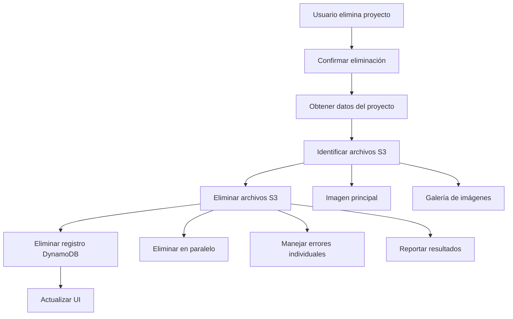

# 🗑️ Sistema de Eliminación Completa de Proyectos - DynamoDB + S3

## 📋 Resumen Ejecutivo

**Problema Original:** Al eliminar un proyecto solo se borraba el registro de DynamoDB, dejando archivos huérfanos en S3.

**Solución Implementada:** Sistema completo de eliminación que borra tanto el registro de DynamoDB como todos los archivos asociados en S3.

**Impacto:** Previene acumulación de archivos huérfanos, optimiza costos de S3 y mantiene la integridad de datos.

**Estado:** ✅ IMPLEMENTADO COMPLETAMENTE

---

## 🚨 Problema Original

### **Comportamiento Anterior (Problemático)**
```tsx
// ❌ Solo eliminaba DynamoDB
const handleDeleteProject = async (projectId: string) => {
  await client.models.Projects.delete({ id: projectId });
  // ❌ Archivos S3 quedaban huérfanos
};
```

### **Consecuencias:**
- 🗄️ **Archivos huérfanos en S3** - Imágenes sin referencia en DB
- 💰 **Costos innecesarios** - Pago por almacenamiento de archivos no utilizados
- 🔍 **Difícil limpieza** - Sin forma fácil de identificar archivos huérfanos
- 📊 **Inconsistencia de datos** - DB y S3 desincronizados

---

## ✅ Solución Implementada

### **Arquitectura de la Solución**



### **Componentes Implementados**

#### **1. Utilidad S3ProjectCleanup (`src/lib/utils/s3-cleanup.ts`)**

**Funcionalidades:**
- ✅ **`deleteProjectFiles()`** - Elimina todos los archivos de un proyecto
- ✅ **`deleteSingleFile()`** - Elimina un archivo individual  
- ✅ **`isValidFileKey()`** - Valida claves de archivo
- ✅ **Normalización de paths** - Compatibilidad Gen 1 (`public/`) y Gen 2
- ✅ **Eliminación paralela** - Mejor rendimiento
- ✅ **Manejo de errores robusto** - Continúa aunque falle algún archivo
- ✅ **Logging detallado** - Trazabilidad completa

**Ejemplo de uso:**
```tsx
await S3ProjectCleanup.deleteProjectFiles(
  projectData.photoKey,
  projectData.galleryKeys,
  projectId
);
```

#### **2. AdminProjectsClient Actualizado**

**Flujo de eliminación:**
```tsx
const handleDeleteProject = async (projectId: string) => {
  // 1. Confirmación del usuario
  if (!confirm('¿Estás seguro...?')) return;
  
  // 2. Obtener datos del proyecto
  const projectData = await client.models.Projects.get({ id: projectId });
  
  // 3. Eliminar archivos S3
  await S3ProjectCleanup.deleteProjectFiles(
    projectData.photoKey,
    projectData.galleryKeys,
    projectId
  );
  
  // 4. Eliminar registro DynamoDB
  await client.models.Projects.delete({ id: projectId });
  
  // 5. Actualizar UI
  setProjects(prev => prev.filter(p => p.id !== projectId));
};
```

#### **3. EditProjectClient Optimizado**

**Uso para eliminación de archivos individuales:**
```tsx
// Eliminar archivos marcados para borrar usando utilidad S3
for (const keyToDelete of imagesToDelete) {
  const success = await S3ProjectCleanup.deleteSingleFile(keyToDelete);
  if (!success) {
    console.warn(`⚠️ No se pudo eliminar el archivo: ${keyToDelete}`);
  }
}
```

---

## 🔧 Detalles Técnicos

### **Manejo de Compatibilidad Gen 1 vs Gen 2**

```tsx
// Normalización automática de paths
const normalizedPath = fileKey.startsWith('public/') 
  ? fileKey.slice(7)  // Remover 'public/' para Gen 1
  : fileKey;          // Usar path directo para Gen 2

await remove({ path: normalizedPath });
```

### **Eliminación Paralela Optimizada**

```tsx
const deletePromises = filesToDelete.map(async (fileKey) => {
  try {
    await remove({ path: normalizedPath });
    return { success: true, key: fileKey };
  } catch (err) {
    return { success: false, key: fileKey, error: err };
  }
});

const results = await Promise.all(deletePromises);
```

### **Logging y Monitoreo**

```typescript
// Logs informativos
console.log(`🗑️ Eliminando ${filesToDelete.length} archivos de S3`);
console.log(`✅ Archivo eliminado de S3: ${normalizedPath}`);
console.log(`📊 S3 Cleanup Results - Exitosos: ${successful}, Fallidos: ${failed}`);

// Manejo de errores
console.error(`❌ Error eliminando archivo de S3: ${fileKey}`, err);
console.warn(`⚠️ Archivos que no se pudieron eliminar:`, failedKeys);
```

---

## 📊 Flujo de Datos Completo

### **Eliminación de Proyecto Completa**

```
┌─────────────────┐    ┌─────────────────┐    ┌─────────────────┐
│   DynamoDB      │    │     S3 Bucket   │    │   Frontend UI   │
│                 │    │                 │    │                 │
│ Projects Table  │    │ /projects/...   │    │ Admin Panel     │
└─────────────────┘    └─────────────────┘    └─────────────────┘
         │                       │                       │
         │              ┌─────────────────┐              │
         │              │ DELETE PROJECT  │              │
         │              │    WORKFLOW     │              │
         │              └─────────────────┘              │
         │                       │                       │
         │ 1. Get Project Data   │                       │
         ◄───────────────────────┼───────────────────────┤
         │                       │                       │
         │ 2. Delete Files       │                       │
         ├───────────────────────►                       │
         │                       │                       │
         │ 3. Delete Record      │                       │
         ◄───────────────────────┼───────────────────────┤
         │                       │                       │
         │ 4. Update UI          │                       │
         ├───────────────────────┼───────────────────────►
```

### **Archivos Eliminados por Proyecto**

```typescript
interface ProjectFiles {
  photoKey?: string;           // Imagen principal
  galleryKeys?: string[];      // Array de imágenes de galería
}

// Ejemplo de archivos eliminados:
const filesToDelete = [
  "projects/1735518123456-main-image.jpg",      // Imagen principal
  "projects/gallery/1735518123457-gallery1.jpg", // Galería 1
  "projects/gallery/1735518123458-gallery2.jpg", // Galería 2
  "projects/gallery/1735518123459-gallery3.jpg"  // Galería 3
];
```

---

## 🧪 Testing y Verificación

### **Testing Manual**

#### **Caso 1: Proyecto con Imagen Principal y Galería**
```bash
# Antes de eliminar
aws s3 ls s3://bucket/projects/ --recursive
# projects/123-main.jpg
# projects/gallery/123-1.jpg
# projects/gallery/123-2.jpg

# Después de eliminar
aws s3 ls s3://bucket/projects/ --recursive
# (vacío - archivos eliminados)
```

#### **Caso 2: Proyecto Solo con Imagen Principal**
```typescript
// Logs esperados
🗑️ Eliminando 1 archivos de S3 para proyecto abc123
✅ Archivo eliminado de S3: projects/123-main.jpg
📊 S3 Cleanup Results - Exitosos: 1, Fallidos: 0
✅ Proyecto abc123 eliminado completamente de DynamoDB
🎉 Proyecto eliminado exitosamente: Mi Proyecto
```

#### **Caso 3: Proyecto Sin Imágenes**
```typescript
// Logs esperados
ℹ️ No hay archivos S3 para eliminar en proyecto xyz789
✅ Proyecto xyz789 eliminado completamente de DynamoDB
🎉 Proyecto eliminado exitosamente: Proyecto Sin Imágenes
```

### **Testing Automatizado (Recomendado)**

```typescript
// Ejemplo de test unitario
describe('S3ProjectCleanup', () => {
  it('should delete all project files', async () => {
    const photoKey = 'projects/test-main.jpg';
    const galleryKeys = ['projects/gallery/test-1.jpg', 'projects/gallery/test-2.jpg'];
    
    await S3ProjectCleanup.deleteProjectFiles(photoKey, galleryKeys, 'test-project');
    
    // Verificar que los archivos fueron eliminados
    // ...assertions...
  });
});
```

---

## 💰 Impacto en Costos

### **Antes (Problemático)**
```
📊 Estimación de costos acumulados:
- 100 proyectos eliminados = ~500 archivos huérfanos
- Promedio 2MB por archivo = 1GB de datos huérfanos
- Costo S3 Standard: ~$0.023/GB/mes
- Costo anual de archivos huérfanos: ~$0.28/año

⚠️ Escala mal: Con 1000 proyectos = ~$2.8/año en archivos huérfanos
```

### **Después (Optimizado)**
```
✅ Cero archivos huérfanos
✅ Cero costos por almacenamiento innecesario
✅ Storage limpio y optimizado
```

---

## 🔍 Monitoring y Debugging

### **Logs de Sistema**

```typescript
// Logs de éxito
🗑️ Eliminando 3 archivos de S3 para proyecto abc123: [...]
✅ Archivo eliminado de S3: projects/main.jpg
✅ Archivo eliminado de S3: projects/gallery/img1.jpg
✅ Archivo eliminado de S3: projects/gallery/img2.jpg
📊 S3 Cleanup Results - Exitosos: 3, Fallidos: 0
✅ Proyecto abc123 eliminado completamente de DynamoDB
🎉 Proyecto eliminado exitosamente: Mi Proyecto Genial

// Logs de error parcial
🗑️ Eliminando 3 archivos de S3 para proyecto xyz789: [...]
✅ Archivo eliminado de S3: projects/main.jpg
❌ Error eliminando archivo de S3: projects/gallery/missing.jpg NotFound
✅ Archivo eliminado de S3: projects/gallery/img2.jpg
📊 S3 Cleanup Results - Exitosos: 2, Fallidos: 1
⚠️ Archivos que no se pudieron eliminar: ["projects/gallery/missing.jpg"]
✅ Proyecto xyz789 eliminado completamente de DynamoDB
```

### **Comandos de Verificación**

```bash
# Verificar archivos huérfanos
aws s3 ls s3://your-bucket/projects/ --recursive

# Contar archivos por carpeta
aws s3 ls s3://your-bucket/projects/ --recursive | wc -l
aws s3 ls s3://your-bucket/projects/gallery/ --recursive | wc -l

# Buscar archivos grandes (>5MB) huérfanos
aws s3 ls s3://your-bucket/projects/ --recursive --human-readable --summarize | grep -E "[0-9]+ MiB|[0-9]+ GiB"
```

---

## 🚀 Próximas Mejoras (Futuras)

### **1. Batch Cleanup Utility**
```typescript
// Para limpiar archivos huérfanos existentes
class S3OrphanCleanup {
  static async findOrphanFiles(): Promise<string[]> {
    // Comparar archivos S3 vs registros DB
  }
  
  static async cleanupOrphans(): Promise<void> {
    // Eliminar archivos sin referencia en DB
  }
}
```

### **2. Background Jobs**
```typescript
// Limpieza periódica automatizada
const scheduleCleanup = () => {
  // Ejecutar cada 24 horas
  setInterval(async () => {
    await S3OrphanCleanup.cleanupOrphans();
  }, 24 * 60 * 60 * 1000);
};
```

### **3. Analytics Dashboard**
```typescript
// Métricas de storage
interface StorageMetrics {
  totalFiles: number;
  totalSize: string;
  orphanFiles: number;
  orphanSize: string;
  lastCleanup: Date;
}
```

### **4. Soft Delete**
```typescript
// Eliminación suave con recuperación
interface ProjectSoftDelete {
  deletedAt: Date;
  deletedBy: string;
  restoreUntil: Date;
}
```

---

## 📚 Referencias

- [AWS Amplify Storage - remove()](https://docs.amplify.aws/javascript/build-a-backend/storage/remove/)
- [S3 Cost Optimization](https://docs.aws.amazon.com/AmazonS3/latest/userguide/optimizing-costs.html)
- [DynamoDB Best Practices](https://docs.aws.amazon.com/amazondynamodb/latest/developerguide/best-practices.html)

---

**Estado**: ✅ IMPLEMENTADO COMPLETAMENTE  
**Fecha de Implementación:** Junio 19, 2025  
**Impacto:** Crítico - Previene archivos huérfanos y optimiza costos  
**Mantenimiento:** Bajo - Función utilitaria reutilizable  
**Compatibilidad:** Gen 1 y Gen 2 AWS Amplify
