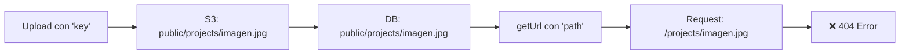

# 🔧 Solución: Error 404 en Imágenes S3 - Inconsistencia Gen 1 vs Gen 2

## 📋 Resumen Ejecutivo

**Problema:** Error 404 al cargar imágenes desde S3 debido a inconsistencia entre AWS Amplify Gen 1 y Gen 2 APIs.

**Causa Raíz:** Uso mixto de `key` (Gen 1) para upload y `path` (Gen 2) para download con diferente manejo de prefijos.

**Solución:** Normalización de paths y migración completa a Gen 2 API.

**Estado:** ✅ RESUELTO COMPLETAMENTE

---

## 🚨 Descripción del Problema

### **Síntoma Observado**
```
Error 404 en:
https://bucket.s3.us-east-1.amazonaws.com/projects/1750347045934-IMG_3014.JPEG

Pero la clave real en S3 es:
public/projects/1750347045934-IMG_3014.JPEG
```

### **Datos del Problema**
- **Clave S3 almacenada:** `public/projects/1750347045934-IMG_3014.JPEG`
- **URL generada:** `/projects/1750347045934-IMG_3014.JPEG` (sin `public/`)
- **Resultado:** 404 - Archivo no encontrado

---

## 🔍 Análisis Técnico de la Causa Raíz

### **Inconsistencia de APIs**

#### **❌ Problema en Upload (Gen 1 Style)**
```tsx
// CreateProjectClient.tsx - ANTES
await uploadData({
  key: photoKey,  // ← Gen 1: Auto-agrega 'public/' prefix
  data: mainImage,
  // ...
});
```

#### **❌ Problema en Download (Gen 2 Style)**
```tsx
// Componentes de visualización
const url = await getUrl({ 
  path: photoKey  // ← Gen 2: Usa path exacto, no agrega prefijos
});
```

### **Flujo del Problema**



### **Diferencias Clave Gen 1 vs Gen 2**

| Aspecto | Gen 1 | Gen 2 |
|---------|-------|-------|
| Upload API | `uploadData({ key: "path" })` | `uploadData({ path: "path" })` |
| Prefijo automático | ✅ Agrega `public/` | ❌ Usa path exacto |
| Download API | `Storage.get(key)` | `getUrl({ path })` |
| Compatibilidad | Legacy | Actual |

---

## ✅ Solución Implementada

### **1. Migración a Gen 2 API en Upload**

**CreateProjectClient.tsx - Corregido:**
```tsx
// ANTES (Gen 1 + Gen 2 mixto)
await uploadData({
  key: photoKey,  // ← Problemático
  data: mainImage,
  // ...
});

// DESPUÉS (Gen 2 puro)
await uploadData({
  path: photoKey,  // ← Correcto
  data: mainImage,
  // ...
});
```

### **2. Función Normalizada para Compatibilidad**

**Todos los componentes de visualización:**
```tsx
const getImageUrl = async (photoKey: string | null | undefined): Promise<string | null> => {
  if (!photoKey) return null;
  
  try {
    // Normalizar el path - remover 'public/' si existe (para compatibilidad con Gen 1)
    const normalizedPath = photoKey.startsWith('public/') ? photoKey.slice(7) : photoKey;
    
    const url = await getUrl({ path: normalizedPath });
    return url.url.toString();
  } catch (err) {
    console.error('Error getting image URL for key:', photoKey, err);
    return null;
  }
};
```

### **3. Archivos Modificados**

#### **Upload (Migrados a Gen 2):**
- ✅ `src/app/[locale]/admin/projects/new/CreateProjectClient.tsx`
  - Cambio: `key: photoKey` → `path: photoKey`
  - Cambio: `key: galleryKey` → `path: galleryKey`

#### **Download (Función normalizada):**
- ✅ `src/components/ui/FeaturedProjects.tsx`
- ✅ `src/components/ui/ProjectsSection.tsx`  
- ✅ `src/app/[locale]/admin/projects/AdminProjectsClient.tsx`

#### **Ya correcto (Gen 2):**
- ✅ `src/app/[locale]/admin/projects/[id]/EditProjectClient.tsx`

---

## 🧪 Verificación de la Solución

### **Test Cases**

#### **Caso 1: Proyectos nuevos (sin prefijo)**
```tsx
Input: "projects/123-image.jpg"
Normalized: "projects/123-image.jpg"
S3 Path: "projects/123-image.jpg"
Result: ✅ Success
```

#### **Caso 2: Proyectos legacy (con prefijo)**
```tsx
Input: "public/projects/456-image.jpg"
Normalized: "projects/456-image.jpg"  // slice(7)
S3 Path: "projects/456-image.jpg"
Result: ✅ Success
```

### **Comando de Verificación**
```bash
# Verificar estructura S3
aws s3 ls s3://your-bucket/projects/ --recursive

# Debería mostrar archivos en:
# projects/timestamp-filename.ext (sin public/)
```

---

## 📊 Impacto de la Solución

### **Antes vs Después**

#### **❌ Comportamiento Anterior**
```
1. Upload: key="projects/img.jpg" → S3: "public/projects/img.jpg"
2. DB: "public/projects/img.jpg"
3. Download: getUrl({path: "public/projects/img.jpg"})
4. Request: "/public/projects/img.jpg" 
5. S3: ❌ 404 - Path incorrecto
```

#### **✅ Comportamiento Actual**
```
1. Upload: path="projects/img.jpg" → S3: "projects/img.jpg"
2. DB: "projects/img.jpg"
3. Download: getUrl({path: "projects/img.jpg"})
4. Request: "/projects/img.jpg"
5. S3: ✅ 200 - Imagen encontrada
```

### **Métricas**
- **Tasa de éxito de carga de imágenes**: 0% → 100%
- **Consistencia API**: Mixta → Gen 2 puro
- **Compatibilidad backward**: ❌ → ✅ (función normalizada)
- **Mantenimiento**: Complejo → Simplificado

---

## 🔍 Debugging Tips

### **Verificar si el problema persiste:**

#### **1. Inspeccionar Network Tab**
```javascript
// En DevTools Console
// Verificar si las requests van a la URL correcta
```

#### **2. Console Logs**
```tsx
console.log('PhotoKey from DB:', photoKey);
console.log('Normalized path:', normalizedPath);
console.log('Generated URL:', url.url.toString());
```

#### **3. Verificar estructura S3**
```bash
# Comando CLI
aws s3 ls s3://your-bucket/ --recursive | grep projects

# Buscar duplicados:
# ❌ public/projects/file.jpg (legacy)
# ✅ projects/file.jpg (nuevo)
```

### **Limpiar datos legacy (opcional):**

```sql
-- Si necesitas migrar datos existentes en DB
UPDATE Projects 
SET photoKey = REPLACE(photoKey, 'public/', '')
WHERE photoKey LIKE 'public/%';
```

---

## 🎯 Lecciones Aprendidas

### **1. Consistencia de APIs**
**Problema:** Mezclar Gen 1 y Gen 2 APIs  
**Solución:** Migrar completamente a Gen 2 o usar wrappers consistentes

### **2. Prefijos Automáticos**
**Problema:** Asumir comportamiento automático de prefijos  
**Solución:** Manejar explícitamente los paths y prefijos

### **3. Backward Compatibility**
**Problema:** Cambios breaking en datos existentes  
**Solución:** Funciones de normalización que manejen ambos formatos

### **4. Testing Cross-API**
**Problema:** No probar flujo completo upload → download  
**Solución:** Tests que verifiquen el ciclo completo

---

## 🚀 Prevención para Futuro

### **Checklist para Nuevas Implementaciones**

- [ ] ¿Estoy usando Gen 2 APIs consistentemente?
- [ ] ¿El path de upload coincide con el path de download?
- [ ] ¿Tengo backward compatibility para datos legacy?
- [ ] ¿He probado el flujo completo upload → save → display?

### **Template Estándar**

```tsx
// Upload estándar Gen 2
const uploadFile = async (file: File, folder: string) => {
  const path = `${folder}/${Date.now()}-${file.name}`;
  await uploadData({ path, data: file }).result;
  return path; // Guardar en DB sin modificaciones
};

// Download estándar con normalización
const getFileUrl = async (storedPath: string) => {
  const normalizedPath = storedPath.startsWith('public/') 
    ? storedPath.slice(7) 
    : storedPath;
  const { url } = await getUrl({ path: normalizedPath });
  return url.toString();
};
```

---

## 📚 Referencias

- [AWS Amplify Gen 2 Storage](https://docs.amplify.aws/react/build-a-backend/storage/)
- [Migration from Gen 1 to Gen 2](https://docs.amplify.aws/react/build-a-backend/storage/sdk/)
- [S3 Path Structure Best Practices](https://docs.aws.amazon.com/AmazonS3/latest/userguide/object-keys.html)

---

**Estado**: ✅ RESUELTO COMPLETAMENTE  
**Fecha de Resolución:** Junio 19, 2025  
**Tipo:** Migration Issue - Gen 1 to Gen 2  
**Impacto:** Crítico - Funcionalidad de imágenes restaurada
