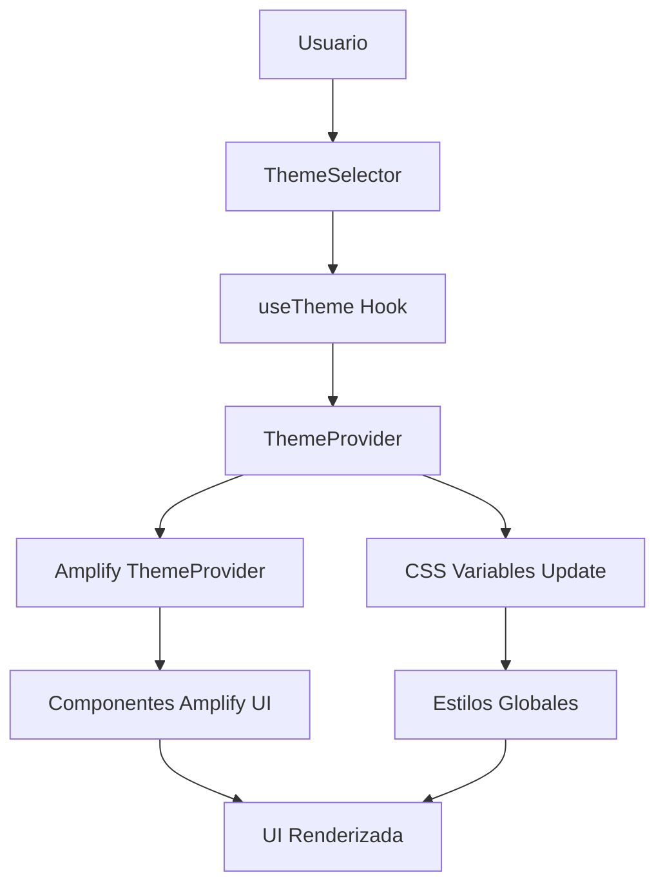

# 🎨 Guía Completa de Theming Personalizado para AWS Amplify UI Components

Esta guía proporciona una implementación completa y profesional de theming personalizado para AWS Amplify UI Components en Next.js con App Router, incluyendo soporte para modo claro y oscuro.

## 📚 Tabla de Contenidos

1. [Visión General del Sistema](#visión-general-del-sistema)
2. [Arquitectura e Integración](#arquitectura-e-integración)
3. [Instalación y Configuración](#instalación-y-configuración)
4. [Implementación Paso a Paso](#implementación-paso-a-paso)
5. [Uso de Componentes](#uso-de-componentes)
6. [Personalización Avanzada](#personalización-avanzada)
7. [Mejores Prácticas](#mejores-prácticas)
8. [Troubleshooting](#troubleshooting)
9. [Optimización y Rendimiento](#optimización-y-rendimiento)

---

## 🌟 Visión General del Sistema

### Características Principales

- **🎭 Tema Personalizado**: Implementación completa de tema personalizado `my-custom-app-theme`
- **🌗 Modo Claro/Oscuro**: Soporte automático para detección y cambio de modo
- **🔄 Sincronización CSS**: Variables CSS globales sincronizadas con tokens de Amplify UI
- **⚡ Persistencia**: Preferencias del usuario guardadas en localStorage
- **🎯 Type Safety**: Completamente tipado en TypeScript
- **📱 Responsive**: Adaptable a diferentes tamaños de pantalla
- **♿ Accesibilidad**: Cumple con estándares de accesibilidad WCAG 2.1
- **🔧 Mantenibilidad**: Arquitectura modular y escalable

### Tecnologías Utilizadas

| Componente | Tecnología | Versión | Propósito |
|------------|------------|---------|-----------|
| **Framework** | Next.js | 15.x | App Router con SSR |
| **UI Library** | AWS Amplify UI | 6.x | Componentes base |
| **Styling** | Tailwind CSS | 4.x | Estilos globales |
| **Theme Engine** | Amplify createTheme | 6.x | Sistema de theming |
| **State Management** | React Context | - | Gestión de modo de tema |
| **Type Safety** | TypeScript | 5.x | Tipado estático |

---

## 🏗️ Arquitectura e Integración

### Estructura de Archivos

```
src/
├── lib/
│   └── theme/
│       └── my-custom-app-theme.ts     # Definición principal del tema
├── hooks/
│   └── useTheme.ts                    # Hook para gestión de modo
├── components/
│   ├── theme/
│   │   ├── ThemeProviderWrapper.tsx   # Provider principal
│   │   ├── ThemeSelector.tsx          # Selector de modo
│   │   └── theme-sync.css            # CSS de sincronización
│   └── examples/
│       └── AmplifyUIShowcase.tsx      # Componente de demostración
└── app/
    ├── layout.tsx                     # Layout principal con ThemeProvider
    └── globals.css                    # Variables CSS globales
```

### Flujo de Theming



---

## ⚙️ Instalación y Configuración

### 1. Dependencias Requeridas

Asegúrate de que tu proyecto tiene las siguientes dependencias instaladas:

```json
{
  "dependencies": {
    "@aws-amplify/ui-react": "^6.11.2",
    "aws-amplify": "^6.15.0",
    "lucide-react": "^0.514.0",
    "next": "15.3.2",
    "react": "^19.0.0",
    "react-dom": "^19.0.0"
  },
  "devDependencies": {
    "tailwindcss": "^4",
    "typescript": "^5.8.3"
  }
}
```

### 2. Configuración de Tailwind CSS

Asegúrate de que Tailwind CSS esté configurado con soporte para dark mode:

```js
// tailwind.config.js
module.exports = {
  darkMode: 'class', // Habilitar dark mode basado en clase
  content: [
    './src/**/*.{js,ts,jsx,tsx,mdx}',
  ],
  theme: {
    extend: {
      // Configuración adicional si es necesaria
    },
  },
}
```

---

## 🚀 Implementación Paso a Paso

### Paso 1: Definición del Tema Base

**Archivo: `src/lib/theme/my-custom-app-theme.ts`**

Este archivo contiene la definición completa del tema personalizado con tokens de diseño para modo claro y oscuro.

**Características clave:**
- ✅ Tokens de color personalizados
- ✅ Tipografía consistente con las fuentes del proyecto
- ✅ Espaciado y bordes estandarizados
- ✅ Componentes completamente estilizados
- ✅ Soporte para modo claro y oscuro

### Paso 2: Hook de Gestión de Tema

**Archivo: `src/hooks/useTheme.ts`**

Hook personalizado que proporciona:
- **Gestión de estado**: Mode claro/oscuro con React Context
- **Persistencia**: Guardado automático en localStorage
- **Detección del sistema**: Respeta `prefers-color-scheme`
- **API sencilla**: Funciones para cambiar y alternar modo

**Uso básico:**
```typescript
const { mode, setMode, toggleMode, isSystemMode } = useTheme();
```

### Paso 3: Provider Principal

**Archivo: `src/components/theme/ThemeProviderWrapper.tsx`**

Componente que envuelve la aplicación y proporciona:
- **Integración con Amplify**: Aplica el tema correcto según el modo
- **Carga de estilos**: Importa automáticamente CSS de Amplify UI
- **Sincronización**: Mantiene consistencia entre sistemas de theming

### Paso 4: Selector de Tema

**Archivo: `src/components/theme/ThemeSelector.tsx`**

Componente interactivo para cambiar el modo de tema:
- **Múltiples variantes**: Dropdown, toggle, buttons
- **Accesibilidad**: Navegación por teclado y screen readers
- **Responsive**: Adaptable a diferentes tamaños
- **Personalizable**: Props para controlar apariencia

**Variantes disponibles:**
```typescript
// Dropdown (por defecto)
<ThemeSelector variant="dropdown" />

// Toggle simple
<ThemeSelector variant="toggle" />

// Botones individuales
<ThemeSelector variant="buttons" />

// Versión compacta
<CompactThemeSelector />
```

### Paso 5: Integración en Layout Principal

**Archivo: `src/app/layout.tsx`**

Actualización del layout para incluir el ThemeProvider:

```typescript
export default function RootLayout({ children }) {
  return (
    <html lang="en" suppressHydrationWarning>
      <head>
        <meta name="theme-color" content="#ffffff" />
      </head>
      <body>
        <ThemeProviderWrapper>
          <AmplifyClientProvider>
            <AuthProvider>
              {children}
            </AuthProvider>
          </AmplifyClientProvider>
        </ThemeProviderWrapper>
      </body>
    </html>
  );
}
```

### Paso 6: Variables CSS Globales

**Archivo: `src/app/globals.css`**

Variables CSS que sincronizan con los tokens de Amplify UI:
- **Consistencia**: Mismos colores en toda la aplicación
- **Flexibilidad**: Fácil personalización desde un lugar central
- **Rendimiento**: Cambios de tema optimizados con CSS

---

## 💻 Uso de Componentes

### Componentes de Amplify UI con Tema

Todos los componentes de AWS Amplify UI automáticamente adoptarán el tema personalizado:

```typescript
import { Button, Card, TextField, Alert } from '@aws-amplify/ui-react';

function MyComponent() {
  return (
    <Card>
      <TextField label="Nombre" placeholder="Tu nombre" />
      <Button variation="primary">Enviar</Button>
      <Alert variation="info">Información importante</Alert>
    </Card>
  );
}
```

### Selector de Tema en la UI

```typescript
import { ThemeSelector } from '@/components/theme/ThemeSelector';

function Header() {
  return (
    <header className="flex justify-between items-center p-4">
      <h1>Mi Aplicación</h1>
      <ThemeSelector variant="dropdown" size="md" />
    </header>
  );
}
```

### Hook useTheme para Logic Personalizada

```typescript
import { useTheme } from '@/hooks/useTheme';

function CustomComponent() {
  const { mode, toggleMode, isSystemMode } = useTheme();
  
  const handleCustomLogic = () => {
    if (mode === 'dark') {
      // Lógica específica para modo oscuro
    }
  };
  
  return (
    <div>
      <p>Modo actual: {mode}</p>
      <button onClick={toggleMode}>Cambiar tema</button>
    </div>
  );
}
```

### Uso con Variables CSS Personalizadas

```css
/* En tus componentes personalizados */
.my-custom-component {
  background-color: hsl(var(--background));
  color: hsl(var(--foreground));
  border: 1px solid hsl(var(--border));
}

.my-custom-button {
  background-color: hsl(var(--primary));
  color: hsl(var(--primary-foreground));
}
```

---

## 🎛️ Personalización Avanzada

### Modificar Tokens de Diseño

Para personalizar los colores de marca, edita el objeto `brandDesignTokens` en `my-custom-app-theme.ts`:

```typescript
const brandDesignTokens = {
  colors: {
    brand: {
      primary: {
        '60': 'hsl(210, 96%, 45%)', // Tu color principal aquí
      }
    }
  }
}
```

### Añadir Nuevos Componentes

Para personalizar componentes adicionales de Amplify UI:

```typescript
// En el tema lightTheme
components: {
  // Componente existente...
  MyCustomComponent: {
    backgroundColor: {value: '{colors.background.primary}'},
    color: {value: '{colors.font.primary}'},
    // ... más estilos
  }
}
```

### Variables CSS Personalizadas

Añade nuevas variables en `globals.css`:

```css
:root {
  --mi-color-personalizado: 120 100% 50%;
  --mi-espaciado-personalizado: 1.5rem;
}

.dark {
  --mi-color-personalizado: 120 100% 70%;
}
```

### Configuración de Fuentes

Personaliza las fuentes en el tema:

```typescript
fonts: {
  default: {
    variable: 'var(--font-mi-fuente)',
    static: 'Mi Fuente, system-ui, sans-serif',
  }
}
```

---

## 🎯 Mejores Prácticas

### 1. Organización de Código

- **Separación de responsabilidades**: Mantén la lógica del tema separada de la lógica de negocio
- **Reutilización**: Usa el hook `useTheme` en lugar de duplicar lógica
- **Consistencia**: Utiliza los tokens de diseño en lugar de valores hardcodeados

### 2. Rendimiento

- **Lazy loading**: Los estilos se cargan solo cuando son necesarios
- **CSS Variables**: Cambios de tema optimizados sin re-renderizado
- **Memoización**: El contexto del tema está memoizado para evitar re-renders innecesarios

### 3. Accesibilidad

- **Contraste**: Los colores del tema cumplen con ratios de contraste WCAG 2.1
- **Navegación por teclado**: El selector de tema es completamente navegable por teclado
- **Screen readers**: Etiquetas y roles ARIA apropiados

### 4. Mantenimiento

- **Documentación**: Documenta cambios importantes en los tokens de diseño
- **Versionado**: Considera versionar cambios significativos en el tema
- **Testing**: Prueba componentes en ambos modos (claro y oscuro)

### 5. Desarrollo

```typescript
// ✅ CORRECTO - Usar tokens del tema
const StyledComponent = styled.div`
  background-color: hsl(var(--background));
  color: hsl(var(--foreground));
`;

// ❌ INCORRECTO - Valores hardcodeados
const StyledComponent = styled.div`
  background-color: #ffffff;
  color: #000000;
`;
```

---

## 🔧 Troubleshooting

### Error: "Cannot read property 'mode' of undefined"

**Causa**: Uso del hook `useTheme` fuera del `ThemeProvider`

**Solución**:
```typescript
// Asegúrate de que el componente esté envuelto en ThemeProviderWrapper
<ThemeProviderWrapper>
  <ComponentQueUsaUseTheme />
</ThemeProviderWrapper>
```

### Error: Hydration mismatch

**Causa**: Diferencias entre servidor y cliente en el primer renderizado

**Solución**: El sistema ya incluye `suppressHydrationWarning` y lógica de hidratación

### Estilos no se aplican correctamente

**Causa**: CSS no está siendo importado o hay conflictos de especificidad

**Solución**:
1. Verifica que `@aws-amplify/ui-react/styles.css` esté importado
2. Asegúrate de que `theme-sync.css` esté cargado
3. Revisa el orden de importación de CSS

### Tema no cambia al hacer toggle

**Causa**: Variables CSS no están actualizándose

**Solución**:
1. Verifica que `applyThemeToDocument` se esté ejecutando
2. Inspecciona las variables CSS en DevTools
3. Asegúrate de que no hay CSS con `!important` conflictivo

### Componentes de Amplify UI no respetan el tema

**Causa**: Tema no está siendo aplicado correctamente al ThemeProvider

**Solución**:
```typescript
// Verifica que el tema se esté pasando correctamente
<AmplifyThemeProvider theme={currentTheme} colorMode={mode}>
  {children}
</AmplifyThemeProvider>
```

---

## ⚡ Optimización y Rendimiento

### Bundle Size

- **Tree shaking**: Solo se importan los componentes de Amplify UI que uses
- **CSS optimizado**: Variables CSS nativas para cambios de tema rápidos
- **Lazy loading**: Los estilos del tema se cargan incrementalmente

### Tiempo de Carga

- **CSS crítico**: Las variables más importantes se cargan primero
- **Preload**: Considera precargar fuentes personalizadas
- **Caching**: Los temas se cachean en localStorage

### Memoria

- **Context optimizado**: El contexto del tema usa `useMemo` para evitar re-renders
- **Event listeners**: Se limpian automáticamente para evitar memory leaks

### Medición de Rendimiento

```typescript
// Hook para medir rendimiento de cambios de tema
const useThemePerformance = () => {
  const startTime = performance.now();
  
  useEffect(() => {
    const endTime = performance.now();
    console.log(`Theme change took ${endTime - startTime} ms`);
  });
};
```

---

## 📋 Consideraciones de Seguridad

### localStorage

- **Validación**: Se valida el contenido antes de aplicar configuraciones guardadas
- **Fallback**: Sistema robusto de fallback si localStorage no está disponible
- **Sanitización**: Los valores se sanitizan antes de guardar

### CSP (Content Security Policy)

```html
<!-- Asegúrate de permitir estilos inline si usas CSS-in-JS -->
<meta http-equiv="Content-Security-Policy" 
      content="style-src 'self' 'unsafe-inline';">
```

### Acceso de Terceros

- **No exposición**: Los tokens de tema no contienen información sensible
- **Encapsulación**: El sistema está completamente encapsulado en el contexto

---

## 🎉 Conclusión

Este sistema de theming personalizado proporciona una base sólida y escalable para aplicaciones Next.js con AWS Amplify UI Components. La implementación prioriza:

- **Facilidad de uso** para desarrolladores
- **Mantenibilidad** a largo plazo
- **Coherencia** de marca
- **Rendimiento** optimizado
- **Accesibilidad** completa

### Próximos Pasos

1. **Implementar** todos los archivos según esta guía
2. **Personalizar** los tokens de diseño según tu marca
3. **Integrar** el ThemeSelector en tu layout principal
4. **Probar** la funcionalidad en desarrollo y producción
5. **Documentar** cualquier personalización adicional

### Recursos Adicionales

- [Documentación oficial de AWS Amplify UI](https://ui.docs.amplify.aws/)
- [Guía de theming de Amplify UI](https://ui.docs.amplify.aws/react/theming)
- [Next.js App Router documentation](https://nextjs.org/docs/app)
- [Tailwind CSS dark mode](https://tailwindcss.com/docs/dark-mode)

¿Necesitas ayuda con algún aspecto específico de la implementación? ¡Consulta los ejemplos de código completos en el directorio `src/components/examples/`!
